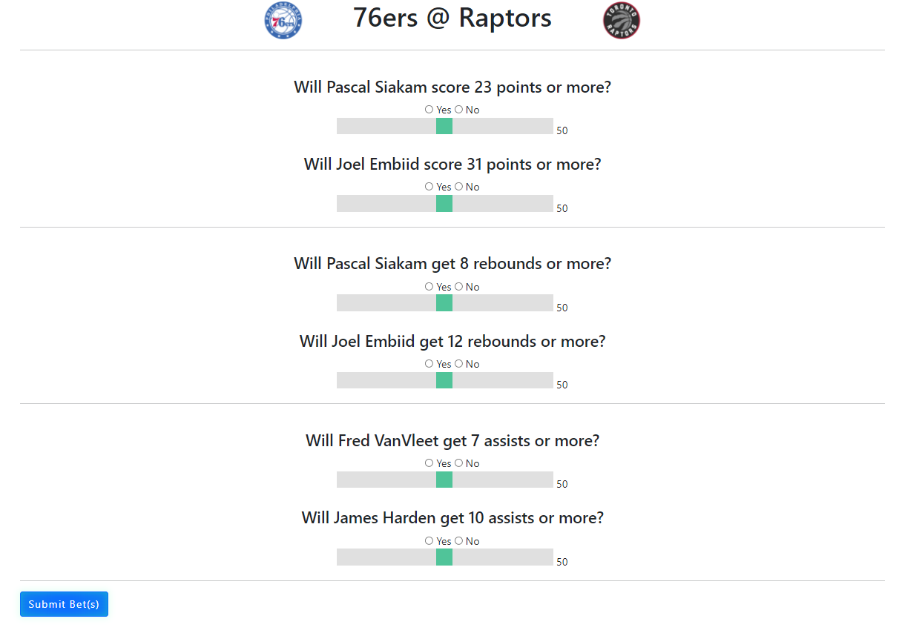

*Created by Aniq Premji and Ethan Luk*

This app enables users to bet on NBA players' statlines in their daily games, and receive virtual currency tokens as a reward for successful predictions.

Data is scraped from the NBA Stats API using Python's requests library to gain information about players' season averages and their statlines per game. A SQL database enables authentication and the creation of user accounts, as well as storage of user bets and each bet's corresponding information.

# Getting Started

## Installing pip
First, make sure you have ```pip``` installed on your system. Run the following command to display the current version of ```pip``` installed on your system:

* Windows: ```py -m pip --version```

* Unix/MacOS: ```python3 -m pip install --user virtualenv```

## Installing and creating a virtual environment
Install virtual environments with the following:

* Windows: ```py -m pip install --user virtualenv```

* Unix/MacOS ```python3 -m pip install --user virtual env```

Next, create a virtual environment by executing the following code in the project's root directory:

* Windows: ```py -m venv env```

* Unix/MacOS: ```python3 -m venv env```

To activate the environment, run ```env\Scripts\activate``` on Windows and ```source env/bin/activate``` for Unix/MacOS.

To install the packages required for the project, run ```py -m pip install -r requirements.txt``` on Windows and ```python3 -m pip install -r requirements.txt``` on Unix/MacOS.

## Usage Guide
In the terminal, run the ```flask run``` command. Click the link provided by the ```Running on:``` statement in the terminal to open the site. To get started, choose a game that you'd like to bet on. 


Select any number of the bets you'd like to make by clicking either yes/no, and using the slider to make a wager of how many coins you'd like to bet.




Once you've submitted your bet, you can check the status of the bet and see if you've won! Successful bets will give you twice as many coins as you wagered.

